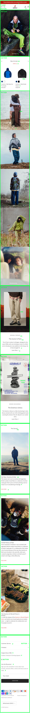
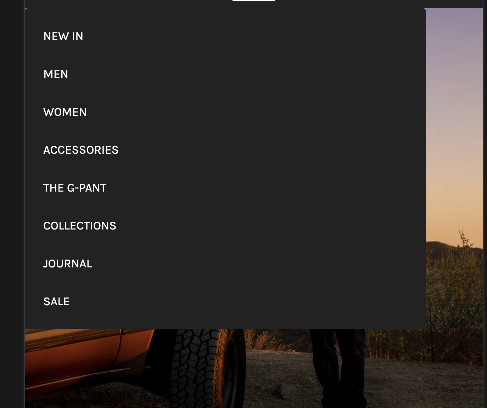
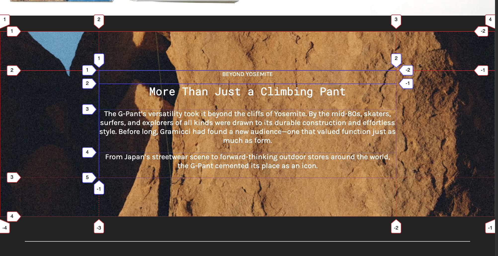
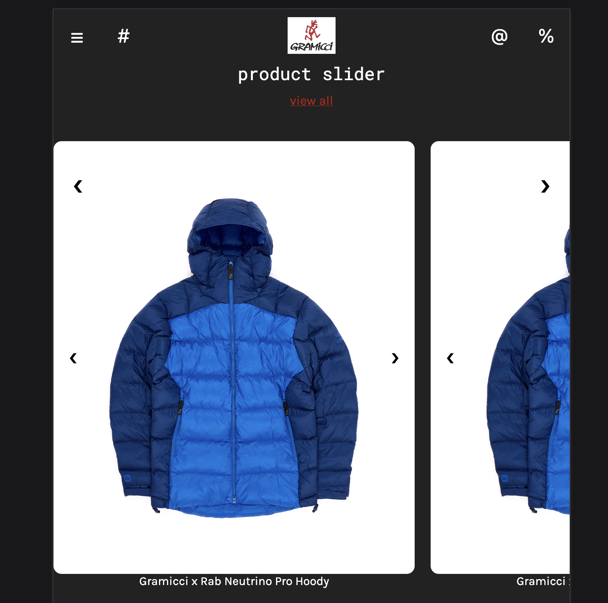
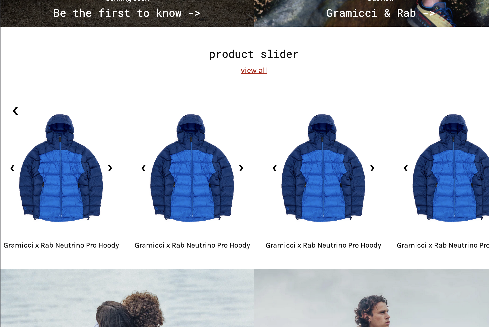

# Procesverslag
Markdown is een simpele manier om HTML te schrijven.  
Markdown cheat cheet: [Hulp bij het schrijven van Markdown](https://github.com/adam-p/markdown-here/wiki/Markdown-Cheatsheet).

Nb. De standaardstructuur en de spartaanse opmaak van de README.md zijn helemaal prima. Het gaat om de inhoud van je procesverslag. Besteedt de tijd voor pracht en praal aan je website.

Nb. Door *open* toe te voegen aan een *details* element kun je deze standaard open zetten. Fijn om dat steeds voor de relevante stuk(ken) te doen.

## Jij

  
uitwerken voor kick-off werkgroep

  ### Auteur:
  Joris van Verseveld

  #### Je startniveau:
  Rood en Zwart

  #### Je focus:
  Responsive
 

## Je website

  
uitwerken voor kick-off werkgroep

  ### Je opdracht:
  https://gramicci.co.uk

  #### Screenshot(s) van de eerste pagina (small screen): 
  Gramicci Home
  

  #### Screenshot(s) van de tweede pagina (small screen):
  Join the G-tribe
  
 

## Toegankelijkheidstest 1/2 (week 1)

  
uitwerken na test in 2e werkgroep

  ### Bevindingen

  Lijst met je bevindingen die in de test naar voren kwamen:
  slecht
  G-pant
  -Elke link begint vertellen dat je de link hebt bezocht, dit kan als verwarrend worden ervaren
  -De fotos op de pagina worden niet uitgeleg. Je krijgt alleen de tekst voorgelezen.
  -Er is een caroussel die bij elke foto vermeld dat deze leeg is, echter zijn er wel degelijk fotos van het product aanwezig.
  -Elke verschillende kleur die je kan kiezen wordt 2 keer opgelezen als je doorgaat naar de volgende kleur.
  Home page
  -Op de homepagina staat er een pijl los van de link die wel meegenomen had moeten zijn.
  -Op de homepagina zijn er 3 afbeeldingen die wel benoemd worden, echter wordt er niet verteld wat er op de foto staat.

  Goed
  -Elk onderdeel wordt duidelijk afgesloten door te vertellen wanneer het einde is en wat er wordt afgesloten.
  -Text is wel makkelijk te begrijpen met de voiceover.
  -Er is een skip to content mogelijkheid. Hierdoor hoef je niet telkens het menu af te gaan.

## Breakdownschets (week 1)

  
uitwerken na afloop 3e werkgroep

  ### de hele pagina: 
  

  ### dynamisch deel (bijv menu): 
  

  ### dynamisch deel (bijv menu): 
  

## Voortgang 1 (week 2)

  
uitwerken voor 1e voortgang

  ### Stand van zaken
  ik ben goed opweg, het was de bedoeling om voor de eerste feedbackronde je html al deels geschreven te hebben. Het is mij gelukt om deze bijna volledig af te hebben.

  Ik wil voor volgende week gaan kijken of ik een beetje Css kan starten.

  ### Agenda voor meeting
  samen met je groepje opstellen

  | student 1      | student 2          | student 3    | student 4        |
  | ---            | ---                | ---          | ---              |
  | dit bespreken  | en dit             | en ik dit    | en dan ik dat    |
  | en dat ook nog | dit als er tijd is | nog een punt | dit wil ik zeker |
  | ...            | ...                | ...          | ...              |

  ### Verslag van meeting
  hier na afloop snel de uitkomsten van de meeting vastleggen

  - punt 1
  - punt 2
  - nog een punt
  - ...

## Voortgang 2 (week 3)

  
uitwerken voor 2e voortgang

  ### Stand van zaken
  Ik heb nog niet echt kunnen zitten aan mijn css waardoor ik nog een beetje op dezelfde plek ben gebleven.

  Wel heb ik nu al mijn HTML afgerond dus het is ready om gebruikt te worden.

  ### Agenda voor meeting
  samen met je groepje opstellen

  | student 1      | student 2          | student 3    | student 4        |
  | ---            | ---                | ---          | ---              |
  | dit bespreken  | en dit             | en ik dit    | en dan ik dat    |
  | en dat ook nog | dit als er tijd is | nog een punt | dit wil ik zeker |
  | ...            | ...                | ...          | ...              |

  ### Verslag van meeting
  hier na afloop snel de uitkomsten van de meeting vastleggen

  - punt 1
  - punt 2
  - nog een punt
- ...

## Toegankelijkheidstest 2/2 (week 4)

  
uitwerken na test in 9e werkgroep

  ### Bevindingen
  Verbeteringen:
  1.Ik heb bij alle img een duidelijke alt tekst toegevoegd daardoor is het duidelijk voor een screenreader wat iets is.
  2.te opzichte van de eerste test heb ik nu een code die helemaal correct is, de validator slaat geen errors aan.
  3.lang element toegevoegd
  4.buttons toegevoegd waar er op de site divs gebruikt werden of de verkeerde manier
  5.light dark mode toegevoegd
  6.meerdere img gedownscaled. op de site werdt een veel te grote variant gebruikt.

  Ik heb ook het Word doc bijgevoegd in mijn inlevermapje. Hier staat de volledige test in.

## Voortgang 3 (week 4)

  
uitwerken voor 3e voortgang

  ### Stand van zaken
  Ik ben nu eindelijk begonnen aan de code, ik vind het nogsteeds lastig maar snap er al iets meer van. Ik loop voor mijn gevoel wel achter, ik moet hem dus echt in de volgende versnelling zetten zodat ik de deadline haal.

  ### Agenda voor meeting
  samen met je groepje opstellen

  | student 1      | student 2          | student 3    | student 4        |
  | ---            | ---                | ---          | ---              |
  | dit bespreken  | en dit             | en ik dit    | en dan ik dat    |
  | en dat ook nog | dit als er tijd is | nog een punt | dit wil ik zeker |
  | ...            | ...                | ...          | ...              |

  ### Verslag van meeting
  hier na afloop snel de uitkomsten van de meeting vastleggen

  - punt 1
  - punt 2
  - nog een punt
  - ...

## Eindgesprek (week 5)

  
uitwerken voor eindgesprek

  ### Je uitkomst - karakteristiek screenshots:
  
  
  

  ### Dit ging goed/Heb ik geleerd: 
  Ik ben Grid helemaal de baas geworden, na veel gekloot heb ik het nu helemaal onder de knie, en heb ik met gemak meerdere grid layouts kunnen maken.

  
  

  ### Dit was lastig/Is niet gelukt:
  Op mijn pagina bevond zich een item slider, helaas is het mij niet gelukt om deze te maken, ik kwam hier ook met verschillende tutorials niet uit. Daarom heb ik via chat een versie laten genereren waar ik zelf nog iets aan door heb gewerkt

  
  

## Bronnenlijst

  
continu bijhouden terwijl je werkt

  Nb. Wees specifiek ('css-tricks' als bron is bijv. niet specifiek genoeg). 
  Nb. ChatGpT en andere AI horen er ook bij.
  Nb. Vermeld de bronnen ook in je code.

  1. ChatGPT: Prompt: Create Responsive Product Slider Using HTML CSS and JavaScript. Ik heb chat gebruikt om een productslider te maken, hier kwam ik zelf namelijk echt niet uit.
  2. https://www.w3schools.com/howto/howto_css_image_text.asp (w3schools) Gebruikt voor een tekst overlay, hier had ik in het begin veel moeite mee en daarom kwam ik ook niet verder. Door deze tutorial kwam ik er wel uit.
  3. https://www.w3schools.com/css/css_rwd_mediaqueries.asp (23schools) om Mediaqueries nog een keer door te nemen.
  4. https://www.w3schools.com/howto/howto_js_mobile_navbar.asp (w3schools) gebruikt voor de nav bar bij mobiele weergave
  5. https://www.youtube.com/watch?v=gmI5nvzv170 voor het maken van de carousel op mijn pagina

